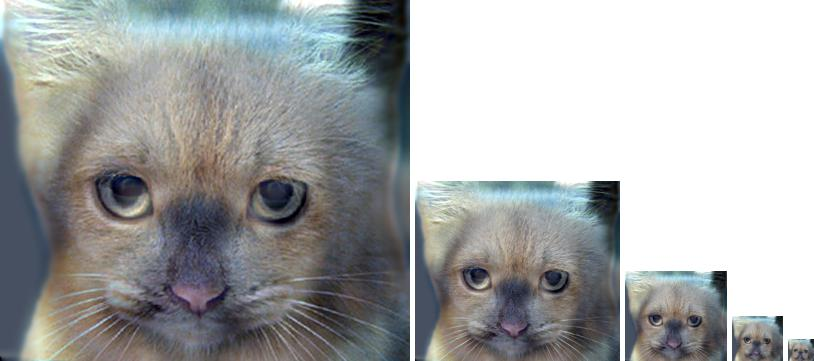

# Hybrid Images

Hybrid images are images that can look like 2 different things at the same time. It exploit's the human eye's low sensitivity to high frequency components of an image at a large distances from the observer to create an illusion. If the image is close to the observer, the details of the image will show a certain object, but as it moves further away, it will look like a different object. Try this at home! Show the below hybrid image to a friend or a family member, and ask them whether it's a cat or a dog. Then move far far away from that person, and then ask them that question again. I assure you their answers would differ!  

## Overview

Hybrid images are created by adding a low pass filtered image with a high pass filtered image. In this project, we implement a convolution function, a function to create a gaussian kernel, and the generation of the hybrid image.

### Filtering
The implementation of filtering can be straightforwardly implemented using for-loops; however, writing loops in python is not efficient and slows down our program. For that we tried utilizing NumPy's API to avoid writing for-loops and hope for a faster code running-time. We also used reflection padding instead of zero padding for the convolution.

### Hybrid image generation
To create a hybrid image, we remove the high frequency components of one image, and the low frequency components of the other image and then add both filtered images together. To remove the high frequencies, we convolve a gaussian kernel of any odd kernel size with the image. To remove the low frequencies, we subtract the gaussian filtered image from the original image.

## Example result
Here we examine the original images of the cat and the dog before filtering.

 
After filtering with cutoff frequency of 500 for the dog and 1000 for the cat, we see the results below.

 
Here, we see how successfully the 2 images blended to look like a dog at a small scale, and a cat at a large scale.

